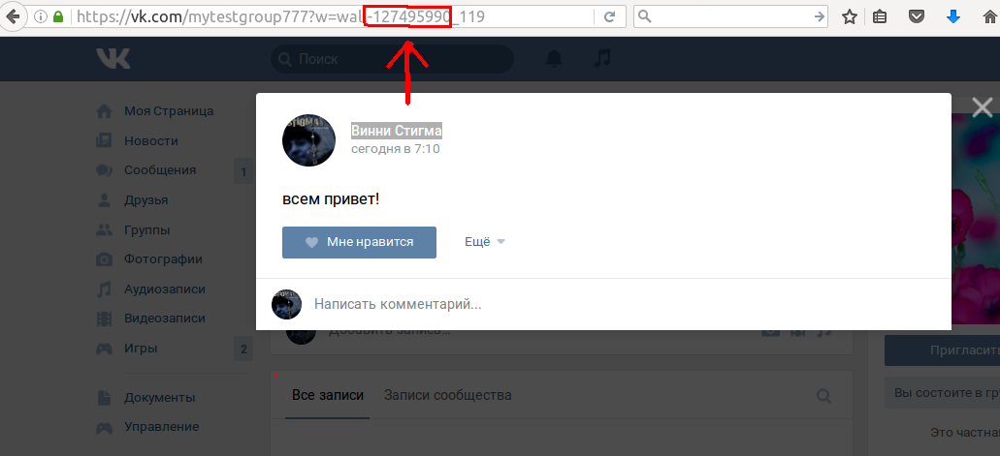

Автопостинг и парсинг комментов VK с помощью API
================================================

Постановка проблемы
-------------------

Мы с ребятами из разных групп арендуем гараж для репетиций. Групп много, их количество, а также количество музыкантов в каждой, постоянно варьируется. Раз в 2 месяца я плачу хозяину гаража определенную сумму, которую мне необходимо собрать с участников. Каждый участник скидывает свою долю, которая определяется по нехитрой формуле НЕОБХОДИМАЯ СУММА / ОБЩЕЕ ЧИСЛО УЧАСТНИКОВ. Для того чтобы собрать нужные сведения и после оповестить ребят, сколько же им скидывать в новом периоде, я прохожу через стандартную процедуру:
- пощу на стену сообщества нашего гаража сообщение с просьбой ответить в комментах сколько от какой группы будет репетировать человек;
- после того как ребята оставят свои комментарии с количество людей в их комманде, мне необходимо посчитать общее количество и вычислить долю каждого музыканта;
- чтобы потом это инфу запостить и всех оповестить.

Давайте попробуем автоматизировать этот процесс в помощью VK API.

Требования
----------

**node** v5.0.0  
**npm** v3.3.6

Создание приложения
-------------------

Сначала нам нужно создать приложение VK. Для этого идём на https://vk.com/dev и клацаем **Создать приложение**.
Вы будете перенаправлены на новую страницу, на которой нужно ввести название вашего приложения и выбрать его тип - **Standalone**.
После чего вам будет предложено подтвердить создание приложения с помощью вашего гаджета.
Тут потребуется устройство с установленным на него приложением VK, на который будет отправлен запрос на подтверждение.


После подтверждения зайдите в настройки приложения и поменяйте ему состояние на **Приложения включено и видно всем**.
Последнее, что нас интересует на странице настроек приложения - это его ID (оно же client id), которое пригодится нам в будущем.

Получение access token'а
------------------------

Для работы с VK API нам потребуется ключ доступа, он же access token. VK поддерживает аж [3 способа получения ключа доступа](https://vk.com/dev/access_token), хороших для разных целей.
Мы получим ключ с помощью Implicit Flow - самого короткого и простого варианта. Ключ к тому же будет вечный (обновлять его не потребуется), что не очень безопасно, но в нашем случае это некритично.

Для того, чтобы получить ключ введите в адресной строке вашего браузера следующее:
https://oauth.vk.com/authorize?client_id=CLIENT_ID&display=page&redirect_uri=https://oauth.vk.com/blank.html&scope=groups,offline&response_type=token
вместо **CLIENT_ID** укажите ID вашего приложения (можно посмотреть на странице настроек вашего приложения, как описано выше).
Остальные параметры:
- ```display=page``` : 	Указывает тип отображения страницы авторизации.
**page** — форма авторизации в отдельном окне;
- ```redirect_uri=https://oauth.vk.com/blank.html``` : Адрес, на который будет переадресован пользователь после прохождения авторизации.
В нашем случае необходимо использовать **redirect_uri** по умолчанию;
- ```scope=groups,offline``` : определяем права, запрашиваемые для генерируемымого access token'а.
**groups** - указывает, что нам нужны права для доступа и постинга в группе, ведь мы хотим постить на стену некой группы,
**offline** - генерирует вечный ключ.
- ```response_type=token```	: Указываем, что мы хотим получить access token с респонсом.

Нужно больше больше прав или более тонкая настройка? [Bсё есть в документации VK](https://vk.com/dev/implicit_flow_user).

Итак, после введения вышеописанного в адресной строке вашего браузера, вам будет предложены залогиниться в VK (если вы уже этого не сделали), после чего вы будете перенаправлены на страницу подтверждения доступа нашего приложения к вашему акаунту.


После клацания на **Разрешить** вы будете перенаправлены на такую страницу.


Искомый ключ необходимо будет скопировать из адресной строки, в которой мы видим следующее: https://oauth.vk.com/blank.html#access_token=LOOONG_KEY&expires_in=0&user_id=YOUR_USER_ID

Среди параметров здесь:
- ```access_token=LOOONG_KEY``` : наш искомый ключ;
- ```expires_in=0``` : указывает на то, что полученный ключ никогда не истечет, он вечен;
- ```YOUR_USER_ID``` : ваш юзер ид, нам он не понадобится.

Итак, ключ получен, можем немного поспамить в наше сообщество.

Постим на стену сообщества с помощью **Budan**
----------------------------------------------

[Склонируйте репозиторий](https://github.com/pavelbely/budan.git) и установите необходимые зависимости:
```npm install```

В ```config.json``` измените параметры на ваши:
- ```vkAccessToken``` : вышеполученный access token;
- ```vkGroupOwnerId``` : id вашего сообщества. Можно посмотреть, клацнув на любой пост в вашем сообществе. В адресной строке будет что-то типа: ```https://vk.com/АДРЕС_СТРАНИЦЫ?w=wall-ИСКОМОЕ_ИД_117%2Fall```,
где наc интересует ИСКОМОЕ_ИД - его вместе со знаком минус его предваряющим и указываем в **vkGroupOwnerId**;  

- ```total``` : итоговая сумма, которую нужно собрать;
- ```currency``` : код валюты этой итоговой суммы в базе НБРБ. Да, мы будем высчитывать итоговую сумму в беларуских рублях по курсу НБРБ. Курс будем вытягивать по [REST API предоставляемому банком](http://www.nbrb.by/APIHelp/ExRates);
- ```periodLengthInMonths``` : продолжительность периода, как часто нужно расплачиваться за гараж, в нашем случае 2 месяца;
- ```daysToAnswerDeadline``` : сколько дней дать ребятам на то, чтобы ответить, т.е. через сколько дней подведём итоги и опубликуем итоговый пост;
- ```commentRegex``` : шаблон коммента, по которому будем определять число музыкантов в группе.  
В нашем случае это <ИМЯ_АРТИСТА_БЕЗ_ПРОБЕЛОВ> <КОЛИЧЕСТВО ЧЕЛОВЕК>. Например, agnosticfront 5;
- ```announcementMessage``` : текст сообщения-опросника количества учатсников;
- ```resultMessage``` : текст итогового сообщения.

Для того, чтобы запостить опросник количества людей выполните комманду
```node makeAnnouncement.js```
После чего на стене вашего сообщества должно появится нужное сообщение.

Теперь давайте сделаем вид, кто ребята откликнулись на ваш опросник и ответили. Добавьте под вашим сообщением несколько комментов по шаблону описанному выше.

А теперь давайте добавим итоговый пост с помощью комманды:
```node collectData.js```.
Смотрим на стену и наслаждаемся.

Теперь осталось только задать расписание выполнения наших скриптов, но об этом несколько позже.
